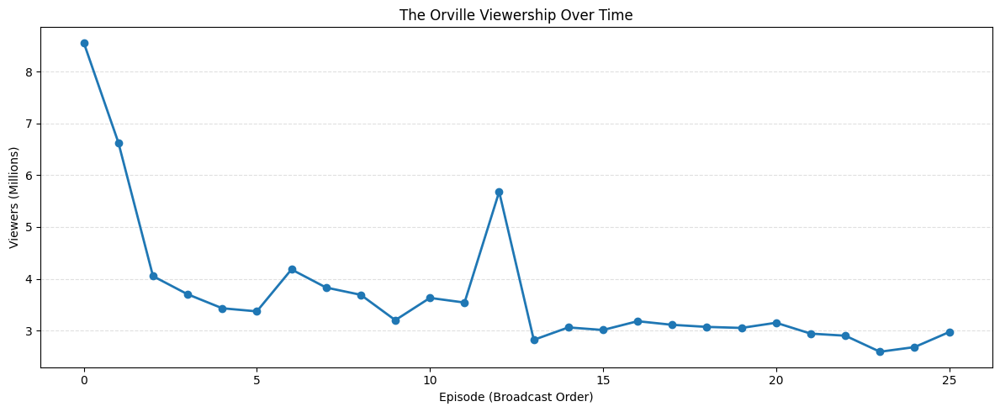
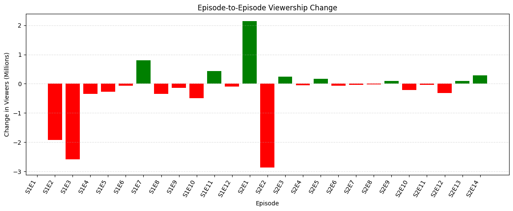

# Short report on *The Orville*


## Synopsis
*The Orville* is an American science fiction comedy drama television series created by **Seth MacFarlane**, who also stars as the protagonist *Ed Mercer*, an officer in the Planetary Union's line of exploratory space vessels in the 25th century. It was inspired primarily by the original Star Trek and Next Generation programs, and the series pays homage to both. The series also draws inspiration from the Star Wars franchise. Produced by **Fuzzy Door Productions** and **20th Television**, it follows the crew of the starship *USS Orville* on their episodic adventures, as well as a serialized story which develops over the length of the series. According to **MacFarlane**, the series and the starship are named after the aviation pioneer Orville Wright.

## Premiere
*The Orville* premiered on September 10, 2017, and ran for two seasons on **Fox** and became available on streaming service Hulu the following day, followed by a third season exclusively on **Hulu**. After generally unfavorable reviews for season 1, season 2 onwards received critical acclaim. The show had relatively successful ratings on **Fox**, becoming the broadcaster's highest-rated Thursday show as well as **Fox's** "most-viewed debut drama" since 2015.

## Cast and Crew
The series features an ensemble cast including **Scott Grimes** as Lieutenant Gordon Mallory, **Adrianne Palicki** as Captain Kelly Grayson, **Peter Macon** as Lieutenant Commander Bortus, **Norm MacDonald** as Dr. Zaander, and **Halston Sage** as Ensign Alara Kitan. The show's production team includes executive producers and writers who have contributed to its distinctive blend of humor and dramatic storytelling.

Source: https://en.wikipedia.org/wiki/The_Orville


## Episode Ratings

The table below summarises the IMDb ratings for all episodes across all three seasons of *The Orville*. Underneath I also included the averages for each season. I used copilot here to generate the data list instead of manually rewriting it, I also used it for some estethic changes like section headers and table formatting. The third season was on Hulu and as such there are no viewership numbers for it on Wikipedia.


```python
import pandas as pd

data = [
    # Season 1
    (1,  1,  "Old Wounds",                              7.8, 8.56),
    (1,  2,  "Command Performance",                     7.8, 6.63),
    (1,  3,  "About a Girl",                            8.4, 4.05),
    (1,  4,  "If the Stars Should Appear",              8.1, 3.70),
    (1,  5,  "Pria",                                    8.2, 3.43),
    (1,  6,  "Krill",                                   8.4, 3.37),
    (1,  7,  "Majority Rule",                           8.3, 4.18),
    (1,  8,  "Into the Fold",                           7.8, 3.83),
    (1,  9,  "Cupid's Dagger",                          7.5, 3.69),
    (1, 10,  "Firestorm",                               8.1, 3.20),
    (1, 11,  "New Dimensions",                          8.0, 3.63),
    (1, 12,  "Mad Idolatry",                            8.3, 3.54),
    # Season 2
    (2,  1,  "Ja'loja",                                 7.4, 5.68),
    (2,  2,  "Primal Urges",                            7.8, 2.82),
    (2,  3,  "Home",                                    8.4, 3.06),
    (2,  4,  "Nothing Left on Earth Excepting Fishes",  8.0, 3.01),
    (2,  5,  "All the World is Birthday Cake",          7.9, 3.18),
    (2,  6,  "A Happy Refrain",                         8.6, 3.11),
    (2,  7,  "Deflectors",                              7.9, 3.07),
    (2,  8,  "Identity, Part I",                        8.8, 3.05),
    (2,  9,  "Identity, Part II",                       8.9, 3.15),
    (2, 10,  "Blood of Patriots",                       7.6, 2.94),
    (2, 11,  "Lasting Impressions",                     8.4, 2.90),
    (2, 12,  "Sanctuary",                               8.2, 2.59),
    (2, 13,  "Tomorrow, and Tomorrow, and Tomorrow",    8.1, 2.68),
    (2, 14,  "The Road Not Taken",                      8.2, 2.97),
    # Season 3 (New Horizons - Hulu)
    (3,  1,  "Electric Sheep",                          8.2, None),
    (3,  2,  "Shadow Realms",                           8.1, None),
    (3,  3,  "Mortality Paradox",                       8.1, None),
    (3,  4,  "Gently Falling Rain",                     8.4, None),
    (3,  5,  "A Tale of Two Topas",                     9.1, None),
    (3,  6,  "Twice in a Lifetime",                     9.0, None),
    (3,  7,  "From Unknown Graves",                     8.3, None),
    (3,  8,  "Midnight Blue",                           8.6, None),
    (3,  9,  "The One That Got Away",                   8.1, None),
    (3, 10,  "Future Unknown",                          8.6, None),
    (3, 11,  "A Little More Perfect",                   8.5, None),
]

df = pd.DataFrame(data, columns=["Season", "Episode", "Title", "IMDb Rating", "Viewers (M)"])
print(df.to_string(index=False))

```

     Season  Episode                                  Title  IMDb Rating  Viewers (M)
          1        1                             Old Wounds          7.8         8.56
          1        2                    Command Performance          7.8         6.63
          1        3                           About a Girl          8.4         4.05
          1        4             If the Stars Should Appear          8.1         3.70
          1        5                                   Pria          8.2         3.43
          1        6                                  Krill          8.4         3.37
          1        7                          Majority Rule          8.3         4.18
          1        8                          Into the Fold          7.8         3.83
          1        9                         Cupid's Dagger          7.5         3.69
          1       10                              Firestorm          8.1         3.20
          1       11                         New Dimensions          8.0         3.63
          1       12                           Mad Idolatry          8.3         3.54
          2        1                                Ja'loja          7.4         5.68
          2        2                           Primal Urges          7.8         2.82
          2        3                                   Home          8.4         3.06
          2        4 Nothing Left on Earth Excepting Fishes          8.0         3.01
          2        5         All the World is Birthday Cake          7.9         3.18
          2        6                        A Happy Refrain          8.6         3.11
          2        7                             Deflectors          7.9         3.07
          2        8                       Identity, Part I          8.8         3.05
          2        9                      Identity, Part II          8.9         3.15
          2       10                      Blood of Patriots          7.6         2.94
          2       11                    Lasting Impressions          8.4         2.90
          2       12                              Sanctuary          8.2         2.59
          2       13   Tomorrow, and Tomorrow, and Tomorrow          8.1         2.68
          2       14                     The Road Not Taken          8.2         2.97
          3        1                         Electric Sheep          8.2          NaN
          3        2                          Shadow Realms          8.1          NaN
          3        3                      Mortality Paradox          8.1          NaN
          3        4                    Gently Falling Rain          8.4          NaN
          3        5                    A Tale of Two Topas          9.1          NaN
          3        6                    Twice in a Lifetime          9.0          NaN
          3        7                    From Unknown Graves          8.3          NaN
          3        8                          Midnight Blue          8.6          NaN
          3        9                  The One That Got Away          8.1          NaN
          3       10                         Future Unknown          8.6          NaN
          3       11                  A Little More Perfect          8.5          NaN
    


```python
season_avg = (
    df.groupby("Season", as_index=False)["IMDb Rating"]
      .mean().round(2)
)

print(season_avg.to_string(index=False))

```

     Season  IMDb Rating
          1         8.06
          2         8.16
          3         8.45
    

## Viewership

From the graphs below we can notice that viewership for *The Orville* follows typical trends for entertainment media. The first episode of season 1 has the highest viewcount of the whole show at 8.56M. What follows are two big drops in -1.93M for episode 2 and -2.58M for episode 3 where viewers not interested in the show stop watching and only the interested audience remains for the rest of the season with some fluctuations. The first episode of season 2 notices an increase in viewership of +2.14M most likely due to marketing and hype generated by being new. The spike is instantly lost with a decrease of -2.86M for the next episode. The same phenomenon from season 1 is repeated here where the viewership does not fluctuate much past the beginning and only the engaged audience remains. 


```python
import matplotlib.pyplot as plt

broadcast_df = df[df["Viewers (M)"].notna()].copy()
broadcast_df["Label"] = (
    "S" + broadcast_df["Season"].astype(str) + "E" + broadcast_df["Episode"].astype(str)
)

# Viewership over time
print("\n--- Viewership Over Time ---\n")
plt.figure(figsize=(12, 5))
plt.plot(
    broadcast_df["Viewers (M)"],
    marker="o",
    linewidth=2,
)

plt.xlabel("Episode (Broadcast Order)")
plt.ylabel("Viewers (Millions)")
plt.title("The Orville Viewership Over Time")
plt.grid(axis="y", linestyle="--", alpha=0.4)
plt.tight_layout()
plt.show()

# Episode-to-episode change in viewership
print("\n--- Episode-to-Episode Change in Viewership ---\n")
broadcast_df["Viewer Change (M)"] = broadcast_df["Viewers (M)"].diff()

colors = ["green" if x >= 0 else "red" for x in broadcast_df["Viewer Change (M)"]]

plt.figure(figsize=(12, 5))
plt.bar(broadcast_df["Label"], broadcast_df["Viewer Change (M)"], color=colors)
plt.xticks(rotation=60, ha="right")
plt.xlabel("Episode")
plt.ylabel("Change in Viewers (Millions)")
plt.title("Episode-to-Episode Viewership Change")
plt.grid(axis="y", linestyle="--", alpha=0.4)
plt.tight_layout()
plt.show()

# AI used for estetics
change_summary = broadcast_df[["Label", "Viewers (M)", "Viewer Change (M)"]].copy()
change_summary.columns = ["Episode", "Viewers (M)", "Change (M)"]
print("\n=== Viewership Change by Episode ===\n")

print(change_summary.to_string(index=False))
```


    

    


    

    


    
    === Viewership Change by Episode ===
    
    Episode  Viewers (M)  Change (M)
       S1E1         8.56         NaN
       S1E2         6.63       -1.93
       S1E3         4.05       -2.58
       S1E4         3.70       -0.35
       S1E5         3.43       -0.27
       S1E6         3.37       -0.06
       S1E7         4.18        0.81
       S1E8         3.83       -0.35
       S1E9         3.69       -0.14
      S1E10         3.20       -0.49
      S1E11         3.63        0.43
      S1E12         3.54       -0.09
       S2E1         5.68        2.14
       S2E2         2.82       -2.86
       S2E3         3.06        0.24
       S2E4         3.01       -0.05
       S2E5         3.18        0.17
       S2E6         3.11       -0.07
       S2E7         3.07       -0.04
       S2E8         3.05       -0.02
       S2E9         3.15        0.10
      S2E10         2.94       -0.21
      S2E11         2.90       -0.04
      S2E12         2.59       -0.31
      S2E13         2.68        0.09
      S2E14         2.97        0.29
    

---

## Season Averages

The table below shows the average IMDb rating for each season. Notable is that despite declining viewership, the critical reception improved significantly from Season 1 to Seasons 2-3.

| Season | Average IMDb Rating |
|--------|---------------------|
| 1      | 8.07                |
| 2      | 8.13                |
| 3      | 8.49                |

---

## Conclusion

The data reveals an interesting disconnect between viewership and critical reception for *The Orville*. While broadcast viewership declined steadily from 8.56M (S1E1) to around 2.6-3.0M by the end of Season 2, IMDb ratings actually *improved* over time, peaking in Season 3 with an average of 8.49/10.

This pattern suggests that the show's core audience became increasingly engaged despite the declining numbers, and the move to Hulu in Season 3 seems to have been a good one at least in terms of ratings. The critical acclaim from Season 2 onwards validates that *The Orville* found its identity as a thoughtful science fiction drama that resonated deeply with those who stuck with it. As for my personal expirience, I really enjoyed the often apperaing commedic moments like the one in the gif below.


